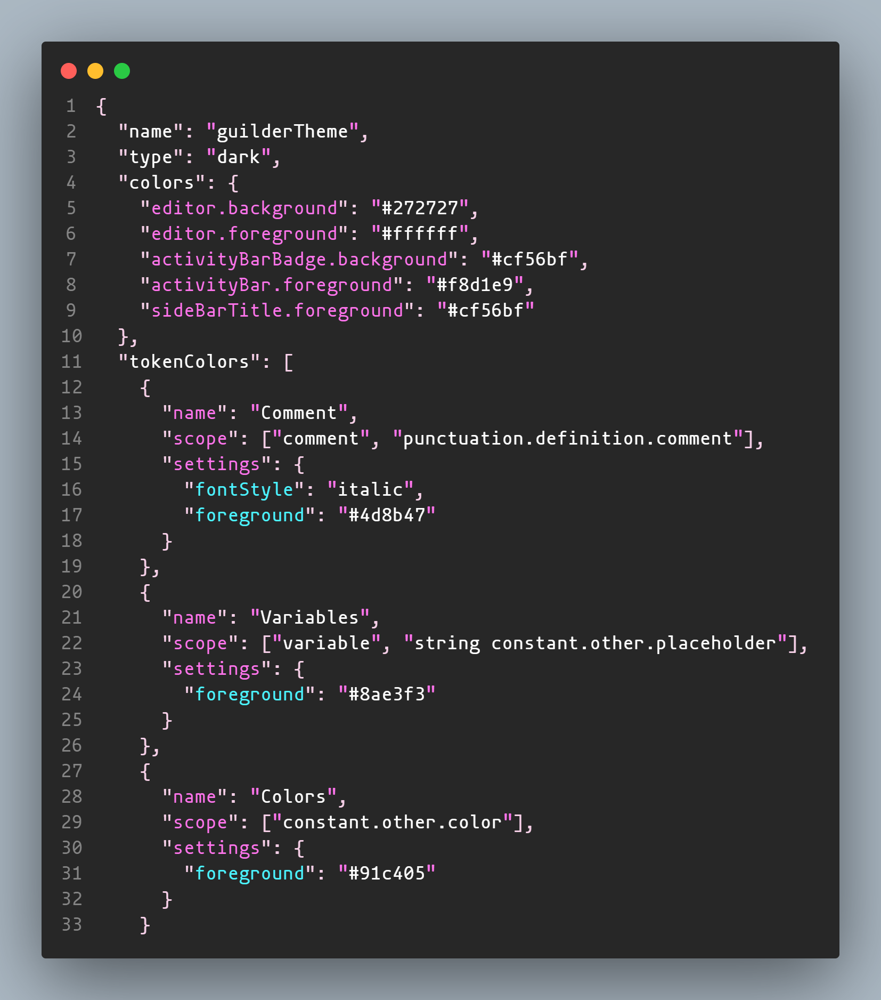
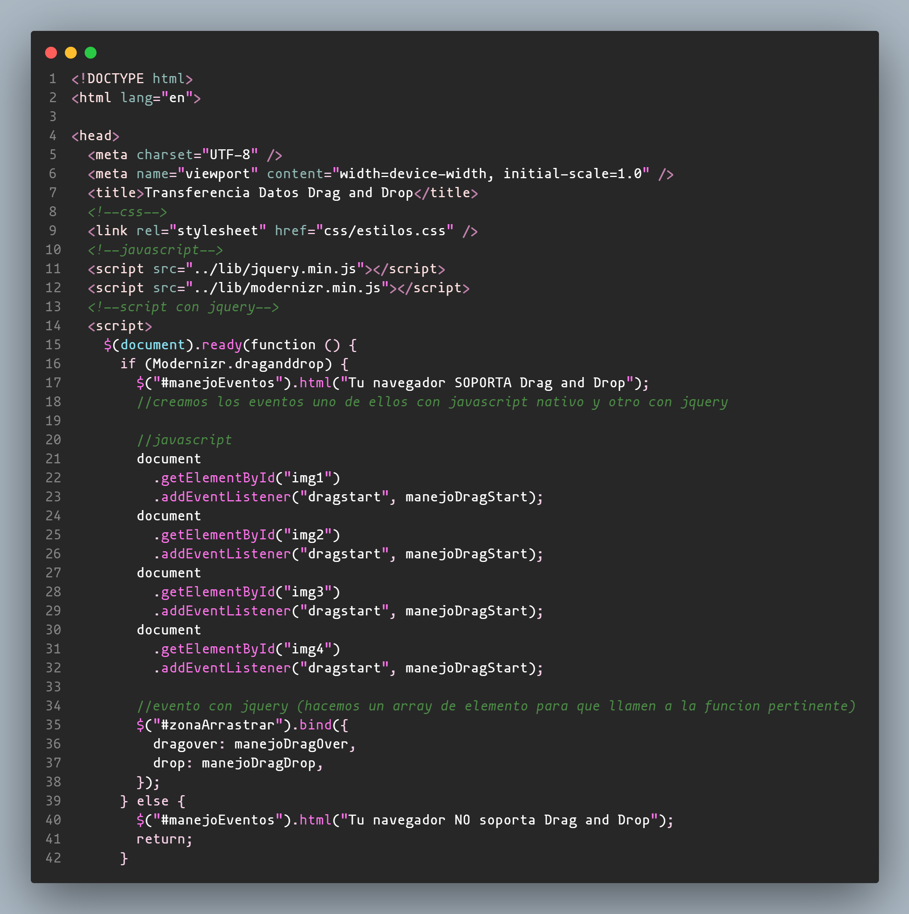

# README
## extension "guilder-theme"
Start to build my first template-theme for VSCode

* Java
* Html
* JavaScript
* Css

### For more information
* [Visual Studio Code's Markdown Support](http://code.visualstudio.com/docs/languages/markdown)
* [Markdown Syntax Reference](https://help.github.com/articles/markdown-basics/)
* [Guilder GitHub](https://github.com/guilder-prog/themeVSCode)

**Enjoy!**

# Imagenes

